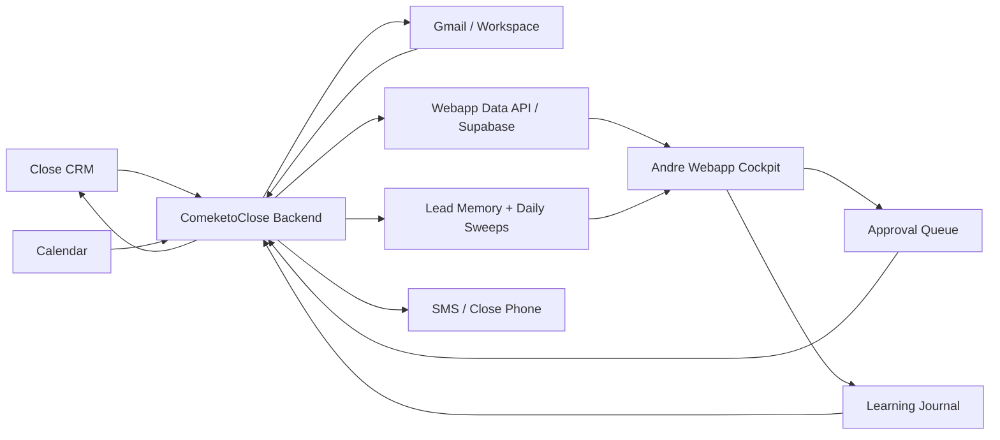

# Andre System Blueprint

Date: 2026-04-13

Scope: Comeketo / Andre sales system only. This does not describe Story, Storie, or any general-purpose agent system.

## North Star

Andre should use one clean Webapp cockpit. The backend automation system can be powerful, messy, and deeply technical, but Andre should not have to operate Claude Code, Claude Co-work, local scripts, or raw Close exports.

The best version is:

```text
Close CRM + Google Workspace + messaging systems
  -> backend automation / Claude Co-work
  -> durable data layer and memory
  -> Webapp cockpit
  -> Andre reviews, edits, approves, skips, defers
  -> approved writes go back to Close / Gmail / SMS
```

The AI is not the boss. The AI is a compression, drafting, memory, and recommendation layer around an explicit sales operating system.

## Recommended System Flow



## Element 1: Andre

Purpose: Andre is the salesperson and final decision-maker for customer-facing action.

Connects from:

- Webapp cockpit shows Andre today's priorities, lead memory, recommended actions, and drafts.
- Slack or notifications can alert Andre that a brief or urgent item is ready.
- Close remains available if Andre wants to inspect the native CRM.

Connects to:

- Approval queue through Webapp buttons: approve, edit, skip, defer.
- Learning journal through corrections: "this lead is hotter than you think", "do not text like that", "this view matters more".
- First-session playbook interview, which captures Andre's rules in his own words.

How:

- Andre should not need to run Claude Co-work.
- Andre should not need to inspect raw JSON or markdown unless he wants to.
- Every customer-facing send should require explicit approval in the Webapp.

## Element 2: Jake

Purpose: Jake owns architecture, system evolution, debugging, and the bridge between backend automation and product UI.

Connects from:

- GitHub for code changes and deployment state.
- Webapp observability panels for what is working or bottlenecking.
- Backend logs, sweeps, memory, and failures.

Connects to:

- Webapp codebase.
- Backend automation prompts and scripts.
- GitHub branches, commits, PRs, and deploys.
- Settings templates and secrets handoff.

How:

- Jake builds the cockpit and backend bridge.
- Jake keeps Story/Storie separate from Comeketo.
- Jake reviews learning summaries and accepts changes to playbook/autonomy when appropriate.

## Element 3: Close CRM

Purpose: Close is the system of record for leads, opportunities, activities, calls, emails, SMS, tasks, statuses, templates, and smart views.

Connects from:

- Andre and team activity inside Close.
- Backend read syncs.
- Approved backend writes after Andre confirms.

Connects to:

- Backend sweeps and live sync.
- Focused Andre views such as Today's Leads, Day 1-5 Cadence, Needs Response, Booked Tastings.
- Webapp through backend APIs, not direct browser secrets.

How:

- Reads should be scoped to Andre's Close user ID.
- Writes should use Andre's own Close API key before production handoff.
- Smart views or saved view IDs should eventually replace heuristic buckets.
- Close API credentials must stay server-side or in backend runner secrets.

## Element 4: ComeketoClose Backend

Purpose: This is the backend operating brain from `/Users/jakeaaron/Desktop/ComeketoClose`. It runs sweeps, writes briefs, keeps memory, follows autonomy rules, and can execute approved writes.

Connects from:

- Close CRM.
- Google Workspace later.
- Webapp approval queue.
- Claude Co-work or scheduled automation runner.
- Local `.env` or secure hosted secrets.

Connects to:

- Sweep folders.
- Lead memory files.
- Action queues.
- Webapp data bridge.
- Close write endpoints for approved actions.
- Slack or notification outputs.

How:

- Morning sweep reads Close and creates `raw.json`, `brief.md`, and action recommendations.
- It should not send customer-facing outbound during unattended sweeps.
- It reads lead memory before drafting.
- It appends to lead memory after every touch.
- It logs every fired action into executed and outbox audit trails.

## Element 5: Webapp Cockpit

Purpose: This is Andre's daily interface. It should hide backend complexity and make the next right action obvious.

Connects from:

- Webapp API server.
- Focused Andre source pack.
- Today brief.
- Approval queue.
- Lead memory.
- AI advisor layer.
- Source health checks.

Connects to:

- Andre approval decisions.
- Draft edits.
- Learning journal entries.
- Backend execution queue.
- Browser storage for local conversations and UI state.

How:

- Main panels should be Today, Leads, Memory, Drafts, Approval Queue, Learning, and Source Health.
- The UI should render markdown from AI and brief outputs cleanly.
- The UI should save AI conversations and decisions to browser storage, and important decisions to the durable backend.
- It should show freshness: when Close was synced, which source generated the brief, and whether data is derived or exact.

## Element 6: Webapp Server

Purpose: The Webapp server is the safe API boundary between browser UI and backend data.

Connects from:

- Browser requests.
- Backend bridge outputs.
- Supabase if used.
- Local data JSON or markdown files.

Connects to:

- `/api/live/andre-focus`
- future `/api/andre-os/today`
- future `/api/andre-os/leads/:leadId/memory`
- future `/api/andre-os/approval-queue`
- future `/api/andre-os/decisions`

How:

- It should never expose raw `.env`, settings secrets, or private backend instructions.
- It should normalize backend markdown/JSON into browser-friendly shapes.
- It should separate read-only endpoints from action endpoints.
- Action endpoints should write approval decisions, not directly fire customer-facing sends unless the safety gate is explicit.

## Element 7: Supabase

Purpose: Supabase can be the shared durable database that lets the backend, Webapp, and future hosted runners agree on current state.

Connects from:

- Live Close sync.
- Backend sweeps.
- Webapp decisions.
- Learning journal events.

Connects to:

- Webapp API queries.
- Backend automation reads.
- Dashboards and source health panels.

How:

- Use Supabase for structured state: leads, opportunities, activities, tasks, snapshots, decisions, run logs.
- Keep markdown memory either in files first or mirror it into Supabase later.
- Do not store raw secrets in Supabase tables visible to the browser.
- Add run IDs so every generated brief can be traced back to source data.

## Element 8: Focused Andre Source Pack

Purpose: This narrows the system from "everything in Close" to the actual views Andre uses every day.

Connects from:

- Close CRM data.
- Close saved views when IDs are available.
- Current derived buckets as an interim bridge.

Connects to:

- Webapp Leads panel.
- Today brief generation.
- Source health.
- Backend sweeps.

How:

- Current directory: `data/andre_close_focus/`.
- Current endpoint: `/api/live/andre-focus`.
- Use screenshot-derived lanes now.
- Replace derived logic with exact Close saved-view API calls when view IDs or URLs are available.

## Element 9: Lead Memory

Purpose: Lead memory gives the system temporal continuity so it does not start over every conversation.

Connects from:

- Backend after every approved action.
- Backend after skipped/deferred actions.
- Andre corrections.
- Close lead fetches for initial facts.

Connects to:

- Morning sweep context.
- Draft generation.
- Webapp lead detail panel.
- Weekly retrospective.

How:

- One memory record per Close lead.
- Append-only chronology.
- Read before drafting or touching a lead.
- Store narrative, not the full Close dump.
- Later index memories for search and retrieval.

## Element 10: Daily Sweeps

Purpose: Daily sweeps convert CRM noise into a ranked daily operating brief.

Connects from:

- Close CRM.
- Lead memory.
- Carryover from prior day.
- Andre playbook rules.
- Focused Andre source pack.

Connects to:

- Today brief panel.
- Approval queue.
- Slack summary.
- Ops tracker.
- Learning journal.

How:

- Run at Andre's morning time.
- Read-only by default.
- Produce raw source, brief, actions, and run log.
- If the machine is asleep or the job fails, log the failure visibly.
- Eventually move from local machine to hosted runner for reliability.

## Element 11: Approval Queue

Purpose: Approval queue is the safety gate between AI recommendations and real-world action.

Connects from:

- Backend action recommendations.
- AI draft studio.
- Webapp edits.
- Andre decisions.

Connects to:

- Close writes.
- Gmail sends.
- SMS sends.
- Lead memory.
- Executed log.

How:

- Every item has type, lead ID, recommended action, draft, source brief ID, risk level, and status.
- Allowed statuses: pending, approved, edited, skipped, deferred, fired, failed.
- Customer-facing sends require per-item approval.
- No "send all" behavior for production.

## Element 12: Email Sending

Purpose: Email sending sends approved customer-facing email.

Connects from:

- Approval queue.
- Close email endpoint or Gmail API.
- Verified sender identity.
- Lead contact data.

Connects to:

- Customer inbox.
- Close activity history.
- Outbox audit copy.
- Lead memory.

How:

- Preferred first path: Close email activity endpoint, because it logs to CRM automatically.
- Gmail API can be added for direct Google Workspace mail if needed.
- Sender identity must be verified before handoff.
- Every send should write an audit record with payload, response, timestamp, and approver.

## Element 13: SMS Sending

Purpose: SMS sending sends approved customer-facing text messages.

Connects from:

- Approval queue.
- Close SMS endpoint or Twilio.
- Close group phone line.
- Lead contact phone.

Connects to:

- Customer phone.
- Close activity history.
- Outbox audit copy.
- Lead memory.

How:

- Preferred first path: Close SMS endpoint using the Close-managed local phone.
- Twilio direct path is only needed if Close cannot support the required flow.
- Inbound SMS routing should be understood because the phone line is shared.
- No unattended customer-facing SMS.

## Element 14: Gmail

Purpose: Gmail is the company email surface and possibly an additional source for customer context.

Connects from:

- Google Workspace OAuth.
- Webapp or backend read tools.
- Approved send requests if using Gmail API.

Connects to:

- Backend search and context gathering.
- Google Workspace memory.
- Email sending if selected.

How:

- Start read-only for search and context.
- Add send only after approval workflow is proven.
- Keep OAuth credentials secure.
- Prefer Close for CRM-related sends unless there is a clear reason to send directly through Gmail.

## Element 15: Google Calendar

Purpose: Calendar provides meeting/tasting context and can trigger pre-meeting briefs.

Connects from:

- Google Workspace OAuth.
- Andre or company calendars.
- Close lead matching logic.

Connects to:

- Pre-meeting brief automation.
- Today panel.
- Lead memory.

How:

- Poll calendar first.
- Add webhook later only if polling is too slow or expensive.
- Match events to Close leads by email, phone, name, event title, or Close URL.
- Send pre-meeting brief to Webapp and optional Slack.

## Element 16: Google Drive, Docs, Sheets

Purpose: Workspace files are company knowledge and reporting surfaces.

Connects from:

- Google Workspace OAuth.
- Company docs, sheets, proposals, menus, playbooks, and reports.

Connects to:

- AI context retrieval.
- Reporting outputs.
- Proposal and menu support.
- Learning journal summaries.

How:

- Start with search/query.
- Add write-back only to selected folders or docs.
- Keep Drive writes explicit and auditable.
- Use Sheets for lightweight reporting if Supabase dashboards are not enough.

## Element 17: Slack

Purpose: Slack is a notification surface, not the approval loop.

Connects from:

- Backend morning sweep.
- Source health alerts.
- Failure alerts.

Connects to:

- Jake DM during smoke test.
- Andre DM or channel after handoff.

How:

- Use Slack for "brief is ready" and critical notifications.
- Do not run customer-facing approval inside Slack unless we later build a proper audit trail.
- Resolve Andre's Slack user ID before handoff.

## Element 18: AI Advisor Layer

Purpose: AI helps compress, explain, draft, and learn. It should not override the operating rules.

Connects from:

- BYOK key in browser or server model settings.
- Lead memory.
- Today brief.
- Andre playbook.
- Comeketo voice rules.
- Recent grades and next-step choices.

Connects to:

- Draft Studio.
- Oracle / assistant panels.
- Next-step chips.
- Learning journal.
- Conversation archive.

How:

- Render markdown correctly in all AI outputs.
- Save conversations locally and important summaries durably.
- Feed recent corrections and high-quality examples into future prompts.
- Make model/provider configurable.
- Keep AI outputs visibly labeled as suggestions until approved.

## Element 19: BYOK Key System

Purpose: BYOK lets a user provide their own model API key without hardcoding shared credentials.

Connects from:

- Browser settings.
- Optional server-side settings.
- AI advisor layer.

Connects to:

- Model calls.
- Local conversation storage.
- Source health UI.

How:

- Store browser BYOK secrets locally, not in tracked files.
- Make it clear which key/provider is active.
- Never send BYOK secrets to GitHub or public logs.
- If server-side automation needs AI, use server secrets separate from browser BYOK.

## Element 20: Conversation Archive

Purpose: Conversation archive prevents the assistant from starting fresh every time.

Connects from:

- Oracle / AI chat.
- Draft Studio.
- Andre decisions.
- Grades and next-step taps.

Connects to:

- Local IndexedDB.
- Durable memory summaries.
- Calendar and journal indexes later.
- AI advisor context.

How:

- Save full local transcripts in browser storage.
- Save durable summaries and decisions to backend memory.
- Index by date, lead, topic, action, and outcome.
- Add retrieval so the assistant can reference recent relevant history.

## Element 21: Learning Journal

Purpose: Learning journal tracks what happened, what was learned, what changed, what it affected, whether it helped, and bottlenecks.

Connects from:

- Daily sweeps.
- Approval decisions.
- Andre corrections.
- Source health.
- Backend run logs.
- Webapp usage events.

Connects to:

- Weekly retrospective.
- Product decisions.
- Playbook updates.
- Jake's debugging flow.

How:

- Keep human-readable daily entries.
- Add automatic rollups from events.
- Separate facts from interpretation.
- Make it easy to answer: are we helping Andre sell better?

## Element 22: Weekly Retrospective

Purpose: Weekly retrospective is the meta-learning loop.

Connects from:

- Executed logs.
- Lead memory.
- Approval queue outcomes.
- Tuning log.
- Close stage movement.
- Learning journal.

Connects to:

- Suggested playbook updates.
- Suggested automation changes.
- Webapp improvement backlog.
- Jake review.

How:

- Run weekly.
- Produce a concise summary with evidence.
- Suggest exact changes, but do not silently mutate core rules.
- Track whether prior changes improved outcomes.

## Element 23: GitHub

Purpose: GitHub coordinates code, history, branches, and collaboration.

Connects from:

- Jake's local Webapp repo.
- Cursor/Codex changes.
- Deployment platform.

Connects to:

- Render auto-deploy.
- PR review.
- Andre testing branch if needed.

How:

- Keep secrets out of Git.
- Use main for stable deployed app.
- Use feature branches for risky changes.
- Write clear summaries so Andre knows what changed.

## Element 24: Render

Purpose: Render hosts the Webapp so Andre can access it from a browser.

Connects from:

- GitHub main branch.
- Environment variables.
- Webapp server.

Connects to:

- Andre browser.
- Supabase.
- Server-side API endpoints.

How:

- Auto-deploy from main after stable commits.
- Configure server secrets in Render env vars.
- Do not rely on local files that only exist on Jake's Mac unless synced to durable storage.
- Show deploy/version in the Webapp.

## Element 25: Local Machine Runner

Purpose: Jake's machine can run the first version of automations quickly.

Connects from:

- Scheduled automation system.
- Claude Co-work.
- Local ComeketoClose folder.
- Local secrets.

Connects to:

- Close CRM.
- Webapp data bridge.
- Slack notifications.
- Local logs.

How:

- Good for smoke tests and rapid iteration.
- Not the final production dependency.
- Needs failure logs and "last successful run" visibility.
- Should eventually move to hosted runner or durable scheduled worker.

## Element 26: Hosted Runner

Purpose: Hosted runner replaces "Jake's Mac must be awake" with reliable scheduled jobs.

Connects from:

- GitHub code.
- Render cron, GitHub Actions, Supabase Edge Functions, or a small VPS.
- Secure environment variables.

Connects to:

- Close CRM.
- Supabase.
- Webapp data.
- Slack notifications.

How:

- Move here after local runner proves the loop.
- Keep jobs small: morning sweep, midday check, weekly retrospective, template refresh.
- Log every run.
- Alert when jobs fail.

## Element 27: Authentication and Permissions

Purpose: Auth decides who can see what and who can approve actions.

Connects from:

- Webapp users.
- Andre identity.
- Jake identity.
- Backend secrets.

Connects to:

- Approval queue.
- Settings.
- Source health.
- Audit logs.

How:

- Andre can approve customer-facing actions.
- Jake can configure system and debug.
- Backend secrets never go to browser.
- Every approval stores who approved and when.

## Element 28: Audit Trail

Purpose: Audit trail makes the system trustworthy.

Connects from:

- Approved actions.
- Fired API calls.
- Failed API calls.
- Skips and deferrals.

Connects to:

- Lead memory.
- Executed logs.
- Outbox audit files.
- Webapp action history.

How:

- Every fired action records payload, response, actor, timestamp, source recommendation, and lead ID.
- Failed actions are logged without automatic retry.
- Customer-facing sends are easy to reconstruct later.

## Element 29: Source Health

Purpose: Source health tells Jake and Andre whether the data can be trusted today.

Connects from:

- Close sync timestamps.
- Backend run logs.
- Google OAuth state.
- Webapp API status.
- Supabase status.

Connects to:

- Webapp status panel.
- Slack failure alerts.
- Daily brief header.

How:

- Show last successful Close sync.
- Show whether focused views are exact saved views or derived buckets.
- Show which sender identity is active.
- Show whether automations ran today.
- Show failures in plain English.

## Element 30: Model Layer

Purpose: Model layer lets the system choose the right AI model for the job.

Connects from:

- AI advisor layer.
- Backend automation.
- BYOK settings.
- Server model settings.

Connects to:

- Drafts.
- Summaries.
- Retrospectives.
- Deep research if needed.

How:

- Use cheaper/faster models for simple summarization.
- Use stronger models for weekly retrospective, playbook distillation, and complex reasoning.
- Keep model choice visible in logs.
- Do not let model choice change approval rules.

## Element 31: File Operations

Purpose: File operations are how the backend reads and writes markdown memory, sweeps, and audit files.

Connects from:

- Backend automation.
- Local runner.
- Hosted runner if file storage is available.

Connects to:

- Memory files.
- Sweep files.
- Outbox files.
- Webapp bridge importer.

How:

- Keep append-only operational files.
- Mirror important file outputs into Supabase or Webapp data for browser access.
- Avoid making Render depend on files living only on the desktop.

## Element 32: Product Management Tools

Purpose: ClickUp or Linear tracks build work, bugs, and bottlenecks.

Connects from:

- Jake planning.
- Weekly retrospective.
- Source health issues.
- Andre feedback.

Connects to:

- Development backlog.
- Release notes.
- Handoff checklist.

How:

- Start with one tool, not both.
- Capture only actionable build tasks.
- Keep sales-memory out of PM tools unless it is a product issue.

## What We Should Build First

Phase 1 should connect the already-working backend outputs to the Webapp.

```text
ComeketoClose sweeps + memory
  -> Webapp import/bridge
  -> Today Brief panel
  -> Lead Memory panel
  -> Approval Queue panel
```

Phase 2 should make approvals round-trip safely.

```text
Webapp approval decision
  -> backend action queue
  -> Close email/SMS/note/task write
  -> audit log
  -> lead memory
  -> Webapp action history
```

Phase 3 should add learning.

```text
Actions + outcomes + Andre corrections
  -> daily learning journal
  -> weekly retrospective
  -> suggested playbook updates
  -> Jake review
```

Phase 4 should harden production.

```text
local runner
  -> hosted runner
  -> stable secrets
  -> source health alerts
  -> Andre-only Webapp access
```

## Key Decisions To Reassess With Jake

- Should the backend source of truth remain markdown files first, or should Supabase become canonical sooner?
- Should email/SMS fire through Close first, or should Gmail/Twilio be added separately?
- Should the local runner stay in place for a week before moving to hosted automation?
- Which project tool is the real build tracker: ClickUp, Linear, GitHub Issues, or the Webapp ops tracker?
- What is the minimum Andre cockpit that is useful enough for him to test without confusion?

## Current Best Answer

Use `/Users/jakeaaron/Desktop/ComeketoClose` as the backend operating system.

Use `/Users/jakeaaron/Documents/Webapp` as Andre's cockpit.

Use Close as the CRM source of truth.

Use Supabase or a Webapp bridge as the shared state layer.

Use AI as an advisor, drafter, compressor, and learner.

Keep every customer-facing action behind explicit approval.
